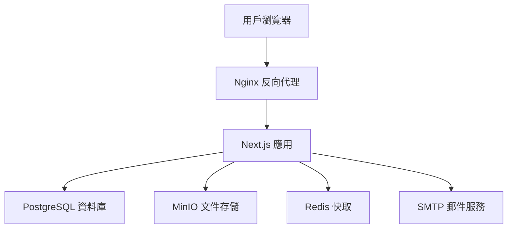

# 科技學術研討會管理平台

> 專為學術研討會設計的現代化投稿審查管理系統，支援多角色工作流程、智慧審稿分配、及完整的稿件生命週期管理

[](https://nextjs.org/)
[](https://www.typescriptlang.org/)
[](https://postgresql.org/)
[](https://docker.com/)

## 📖 系統簡介

**科技學術研討會管理平台** 是一套專為學術機構打造的完整投稿審查管理解決方案。系統整合了投稿者、審稿人、編輯及主編的完整工作流程，提供從投稿提交到最終發表的全方位管理功能。

### 🎯 核心價值
- **提升審稿效率** - 智慧審稿人分配與工作負荷管理
- **優化投稿體驗** - 6步驟直觀投稿流程，支援草稿保存
- **強化品質控制** - 雙盲同儕審查與多層決議機制
- **數據驅動決策** - 即時統計分析與進度追蹤

## ✨ 核心功能

### 👤 多角色管理系統
| 角色 | 核心功能 | 權限範圍 |
|------|----------|----------|
| **投稿者** | 稿件提交、草稿管理、修訂回覆 | 個人投稿管理 |
| **審稿人** | 同儕審查、評分建議、專業評論 | 指派稿件審查 |
| **編輯** | 審稿人分配、流程管理、初步決議 | 編輯範圍稿件 |
| **主編** | 最終決議、期刊策略、團隊管理 | 全系統管理 |

### 🚀 智慧投稿管理
- **6步驟投稿流程** - 類型選擇 → 內容填寫 → 檔案上傳 → 作者資訊 → 聲明確認 → 最終檢查
- **草稿自動保存** - 即時保存進度，支援跨裝置續寫
- **多作者協作** - 支援通訊作者指定與作者資訊管理
- **版本控制** - 完整的修訂歷程追蹤

### 🔍 進階審稿系統
- **智慧分配機制** - 基於專業領域與工作負荷的最佳分配
- **雙盲審查** - 保護投稿者與審稿人隱私
- **評分標準化** - 10分制評分系統，支援詳細評論
- **截止日期管理** - 自動提醒與進度追蹤

### 📊 數據分析儀表板
- **即時統計** - 投稿數量、審稿進度、決議分析
- **工作負荷監控** - 審稿人工作量可視化
- **效率指標** - 平均審稿時間、決議週期分析

## 🏗️ 技術架構

### 💻 現代化技術棧
```
前端框架    Next.js 15 + TypeScript + Tailwind CSS
資料庫     PostgreSQL 15 + Prisma ORM
認證系統    JWT + HttpOnly Cookie + 角色權限控制
檔案存儲    MinIO (AWS S3 相容)
郵件服務    SMTP + 模板引擎
容器化     Docker + Docker Compose
快取系統    Redis
代理服務    Nginx
```

### 🎨 設計系統
基於 **Figma** 設計，採用 **Noto Sans TC** 字體的現代化學術風格：

| 元素 | 設計規範 | 應用場景 |
|------|----------|----------|
| 主色調 `#187DF8` | 現代科技藍 | 主要操作按鈕、連結 |
| 成功色 `#5BC900` | 生機綠 | 成功狀態、完成標示 |
| 警告色 `#FF6231` | 活力橙 | 錯誤提示、重要通知 |
| 角色識別色 | 紫色/藍綠/藍色系 | 主編/審稿人/作者身份 |

## 🚀 快速開始

### 📋 環境需求
- **Node.js** >= 18.17.0
- **pnpm** >= 8.0.0
- **Docker** & Docker Compose

### ⚡ 一鍵啟動

```bash
# 1. 複製專案並安裝依賴
git clone <repository-url>
cd conference-platform
pnpm install

# 2. 啟動開發環境（包含所有服務）
make dev
pnpm dev

# 3. 初始化資料庫
pnpm db:generate && pnpm db:push && pnpm db:seed
```

### 🌐 服務訪問

| 服務 | 地址 | 用途 |
|------|------|------|
| **主應用** | http://localhost:3000 | 學術研討會管理系統 |
| **郵件測試** | http://localhost:8025 | MailHog 郵件預覽 |
| **MinIO 控制台** | http://localhost:9001 | 檔案儲存管理 |
| **資料庫** | localhost:5433 | PostgreSQL 連線 |

### 👥 測試帳號

| 角色 | 帳號 | 密碼 | 功能範圍 |
|------|------|------|----------|
| **主編** | chief@conference.example.com | chief123456 | 系統完整管理權限 |
| **編輯** | editor@conference.example.com | editor123456 | 稿件編輯審查權限 |
| **審稿人** | reviewer@conference.example.com | reviewer123456 | 稿件審查評分權限 |

## 🔧 開發指南

### ⚙️ 常用指令

```bash
# 環境管理
make dev          # 啟動開發環境（基礎服務）
make up           # 啟動完整環境
make down         # 停止所有服務
make clean        # 清理容器和資料

# 開發工具
pnpm dev          # 啟動 Next.js 應用
pnpm type-check   # TypeScript 類型檢查
pnpm lint         # ESLint 代碼檢查

# 資料庫操作
pnpm db:generate  # 生成 Prisma Client
pnpm db:push      # 同步資料庫 Schema
pnpm db:seed      # 填充測試資料
```

### 📊 系統架構



## 🛡️ 安全與合規

### 🔐 安全機制
- **密碼加密**: Bcrypt 雜湊演算法
- **Session 管理**: JWT + HttpOnly Cookie
- **權限控制**: 基於角色的訪問控制 (RBAC)
- **資料驗證**: Zod Schema 前後端驗證
- **檔案安全**: MIME 類型檢查與大小限制

### 🎯 SEO 與 AI 搜尋最佳化

本系統採用**先進的 AI SEO 策略**，專為現代搜尋引擎與 AI 助手優化：

#### 📈 結構化標記支援
- **Schema.org 標記**: Organization, Product, FAQs, Reviews
- **Open Graph**: Facebook, LinkedIn 社群分享優化  
- **Twitter Cards**: Twitter 分享卡片支援
- **JSON-LD**: 結構化資料標記，提升 AI 理解度

#### 🤖 AI 搜尋引擎優化
- **ChatGPT 友好**: 清晰的標題結構與內容組織
- **Google Gemini 支援**: 語意化 HTML 與內容標記
- **Perplexity 最佳化**: 問答式內容結構
- **RSS Feed**: 自動生成內容摘要供 AI 爬蟲使用

#### 🌐 多語系支援
- **中英雙語**: 完整的中英文內容支援
- **語意優化**: 針對不同語言的搜尋習慣優化
- **文化適應**: 符合學術領域的專業用語規範

## 📞 支援與聯絡

### 🆘 技術支援
- **文件**: [完整開發文件](docs/)
- **API 參考**: [API 接口說明](docs/api.md)
- **問題回報**: [GitHub Issues](https://github.com/your-org/conference-platform/issues)

### 👥 社群與貢獻
- **貢獻指南**: [CONTRIBUTING.md](CONTRIBUTING.md)
- **程式碼規範**: ESLint + Prettier
- **授權**: MIT License

---

<div align="center">

**科技學術研討會管理平台** • 讓學術交流更簡單高效

© 2024 國立臺北教育大學課程與教學傳播科技研究所

[](https://github.com/your-org/conference-platform)
[](https://opensource.org/licenses/MIT)

</div>
