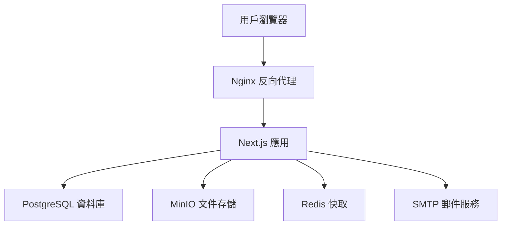

# 科技學術研討會管理平台

> 專為學術研討會設計的現代化投稿審查管理系統，支援多角色工作流程、智慧審稿分配、及完整的稿件生命週期管理

[](https://nextjs.org/)
[](https://www.typescriptlang.org/)
[](https://postgresql.org/)
[](https://docker.com/)

## 📖 系統簡介

**科技學術研討會管理平台** 是一套專為學術機構打造的完整投稿審查管理解決方案。系統整合了投稿者、審稿人、編輯及主編的完整工作流程，提供從投稿提交到最終發表的全方位管理功能。

### 🎯 核心價值
- **提升審稿效率** - 智慧審稿人分配與工作負荷管理
- **優化投稿體驗** - 6步驟直觀投稿流程，支援草稿保存
- **強化品質控制** - 雙盲同儕審查與多層決議機制
- **數據驅動決策** - 即時統計分析與進度追蹤

## ✨ 核心功能

### 👤 多角色管理系統
| 角色 | 核心功能 | 權限範圍 |
|------|----------|----------|
| **投稿者** | 稿件提交、草稿管理、修訂回覆 | 個人投稿管理 |
| **審稿人** | 同儕審查、評分建議、專業評論 | 指派稿件審查 |
| **編輯** | 審稿人分配、流程管理、初步決議 | 編輯範圍稿件 |
| **主編** | 最終決議、期刊策略、團隊管理 | 全系統管理 |

### 🚀 智慧投稿管理
- **6步驟投稿流程** - 類型選擇 → 內容填寫 → 檔案上傳 → 作者資訊 → 聲明確認 → 最終檢查
- **草稿自動保存** - 即時保存進度，支援跨裝置續寫
- **多作者協作** - 支援通訊作者指定與作者資訊管理
- **版本控制** - 完整的修訂歷程追蹤

### 🔍 進階審稿系統
- **智慧分配機制** - 基於專業領域與工作負荷的最佳分配
- **雙盲審查** - 保護投稿者與審稿人隱私
- **評分標準化** - 10分制評分系統，支援詳細評論
- **截止日期管理** - 自動提醒與進度追蹤
- **郵件通知系統** - 自動發送審稿指派通知給審稿人

### 📊 數據分析儀表板
- **即時統計** - 投稿數量、審稿進度、決議分析
- **工作負荷監控** - 審稿人工作量可視化
- **效率指標** - 平均審稿時間、決議週期分析

## 🏗️ 技術架構

### 💻 現代化技術棧
```
前端框架    Next.js 15 + TypeScript + Tailwind CSS
資料庫     PostgreSQL 15 + Prisma ORM
認證系統    JWT + HttpOnly Cookie + 角色權限控制
檔案存儲    MinIO (AWS S3 相容)
郵件服務    SMTP + 模板引擎
容器化     Docker + Docker Compose
快取系統    Redis
代理服務    Nginx
```

### 🎨 設計系統
基於 **Figma** 設計，採用 **Noto Sans TC** 字體的現代化學術風格：

| 元素 | 設計規範 | 應用場景 |
|------|----------|----------|
| 主色調 `#187DF8` | 現代科技藍 | 主要操作按鈕、連結 |
| 成功色 `#5BC900` | 生機綠 | 成功狀態、完成標示 |
| 警告色 `#FF6231` | 活力橙 | 錯誤提示、重要通知 |
| 角色識別色 | 紫色/藍綠/藍色系 | 主編/審稿人/作者身份 |

## 🚀 快速開始

### 📋 環境需求
- **Node.js** >= 18.17.0
- **pnpm** >= 8.0.0
- **Docker** & Docker Compose

### ⚡ 一鍵啟動

```bash
# 1. 複製專案並安裝依賴
git clone <repository-url>
cd conference-platform
pnpm install

# 2. 啟動開發環境（包含所有服務）
make dev
pnpm dev

# 3. 初始化資料庫
pnpm db:generate && pnpm db:push && pnpm db:seed
```

### 🌐 服務訪問

| 服務 | 地址 | 用途 |
|------|------|------|
| **主應用** | http://localhost:3000 | 學術研討會管理系統 |
| **郵件測試** | http://localhost:8025 | MailHog 郵件預覽 |
| **MinIO 控制台** | http://localhost:9001 | 檔案儲存管理 |
| **資料庫** | localhost:5433 | PostgreSQL 連線 |

### 👥 測試帳號

| 角色 | 帳號 | 密碼 | 功能範圍 |
|------|------|------|----------|
| **主編** | chief@conference.example.com | chief123456 | 系統完整管理權限 |
| **編輯** | editor@conference.example.com | editor123456 | 稿件編輯審查權限 |
| **審稿人** | reviewer@conference.example.com | reviewer123456 | 稿件審查評分權限 |

## 🔧 開發指南

### ⚙️ 常用指令

```bash
# 環境管理
make dev          # 啟動開發環境（基礎服務）
make up           # 啟動完整環境
make down         # 停止所有服務
make clean        # 清理容器和資料

# 開發工具
pnpm dev          # 啟動 Next.js 應用
pnpm type-check   # TypeScript 類型檢查
pnpm lint         # ESLint 代碼檢查

# 資料庫操作
pnpm db:generate  # 生成 Prisma Client
pnpm db:push      # 同步資料庫 Schema
pnpm db:seed      # 填充測試資料
```

### 📊 系統架構



## 🛡️ 安全與合規

### 🔐 安全機制
- **密碼加密**: Bcrypt 雜湊演算法
- **Session 管理**: JWT + HttpOnly Cookie
- **權限控制**: 基於角色的訪問控制 (RBAC)
- **資料驗證**: Zod Schema 前後端驗證
- **檔案安全**: MIME 類型檢查與大小限制

### 🎯 SEO 與 AI 搜尋最佳化

本系統採用**先進的 AI SEO 策略**，專為現代搜尋引擎與 AI 助手優化：

#### 📈 結構化標記支援
- **Schema.org 標記**: Organization, Product, FAQs, Reviews
- **Open Graph**: Facebook, LinkedIn 社群分享優化  
- **Twitter Cards**: Twitter 分享卡片支援
- **JSON-LD**: 結構化資料標記，提升 AI 理解度

#### 🤖 AI 搜尋引擎優化
- **ChatGPT 友好**: 清晰的標題結構與內容組織
- **Google Gemini 支援**: 語意化 HTML 與內容標記
- **Perplexity 最佳化**: 問答式內容結構
- **RSS Feed**: 自動生成內容摘要供 AI 爬蟲使用

#### 🌐 多語系支援
- **中英雙語**: 完整的中英文內容支援
- **語意優化**: 針對不同語言的搜尋習慣優化
- **文化適應**: 符合學術領域的專業用語規範

## 📞 支援與聯絡

### 🆘 技術支援
- **文件**: [完整開發文件](docs/)
- **API 參考**: [API 接口說明](docs/api.md)
- **問題回報**: [GitHub Issues](https://github.com/your-org/conference-platform/issues)

### 👥 社群與貢獻
- **貢獻指南**: [CONTRIBUTING.md](CONTRIBUTING.md)
- **程式碼規範**: ESLint + Prettier
- **授權**: MIT License

## 📝 更新日誌

### 2025-08-22 (投稿作者步驟四 UI/UX 全面升級)
- **重大升級**: 投稿步驟四作者管理功能全面重構，提升用戶體驗
  - ✅ **模態視窗新增/編輯** - 取代簡陋的 prompt，實作美觀的模態視窗：
    - 響應式設計的作者資訊輸入表單
    - 清晰的欄位標示（電子郵件*、作者*、服務單位與職稱）
    - 符合設計規範的藍色主色調與按鈕樣式
    - ESC 鍵或點擊背景可取消操作
  - ✅ **完整功能實作** - 新增三個關鍵函數解決 JavaScript 錯誤：
    - `setCorresponding(index)` - 設定通訊作者，確保只有一位通訊作者
    - `addAuthor()` / `editAuthor(index)` - 開啟模態視窗進行新增/編輯
    - `moveAuthor(index, direction)` - 調整作者順序，支援上移下移功能
  - ✅ **表單驗證強化** - 完整的前端驗證機制：
    - 必填欄位檢查（姓名、機構、電子郵件）
    - 電子郵件格式驗證（正規表達式檢查）
    - 友善錯誤提示，引導用戶正確填寫
  - ✅ **空列表顯示優化** - 將空作者列表顯示文字從「尚未新增作者」改為簡潔的「沒有」
- **技術實現**:
  - **狀態管理**: `showAuthorModal`, `modalMode`, `editingAuthorIndex`, `modalAuthorData`
  - **模態視窗**: 使用 `fixed inset-0` + `z-50` 實現覆蓋層
  - **響應式設計**: `max-w-md w-full mx-4` 確保手機端適配
  - **表單控制**: 受控組件，即時狀態同步
  - **輸入驗證**: 正規表達式 + 必填欄位檢查
- **用戶體驗改善**:
  - 取代簡陋的 browser prompt，提供現代化的表單界面
  - 視覺設計符合整體系統風格，維持一致性
  - 清晰的操作流程，減少用戶困惑
  - 完整的錯誤處理與用戶回饋機制

### 2025-08-22 (生產環境容器化部署完成)
- **重大部署升級**: Word轉PDF功能完整生產環境適配
  - ✅ **Docker 容器化支援** - 完整的容器化部署配置
    - Dockerfile 整合 LibreOffice 和相關字型套件
    - Alpine Linux 輕量化基礎映像
    - 多階段建置最佳化映像大小
    - 非 root 用戶安全運行
  - ✅ **生產環境配置** - 完整的生產部署方案
    - `docker-compose.prod.yml` 生產環境配置
    - 環境變數管理與安全配置
    - 檔案上傳目錄持久化存儲
    - 健康檢查與自動重啟機制
  - ✅ **自動化部署腳本** - 一鍵部署解決方案
    - `scripts/build-production.sh` 自動建置腳本
    - `scripts/test-word-conversion.sh` 轉換功能測試
    - 完整的錯誤處理與狀態檢查
    - 服務啟動順序與依賴管理
  - ✅ **檔案轉換最佳化** - 生產環境轉換引擎
    - 跨環境命令適配（`soffice` vs `libreoffice`）
    - 30秒轉換超時保護
    - 詳細錯誤日誌與診斷信息
    - 臨時檔案自動清理機制
- **部署特性**:
  - **一鍵部署**: `./scripts/build-production.sh`
  - **容器隔離**: 完整的微服務架構
  - **資料持久化**: uploads、資料庫、Redis 資料保存
  - **服務監控**: 健康檢查與狀態監控
  - **安全防護**: 非特權用戶、檔案權限控制
- **技術架構**:
  - **基礎映像**: Node.js 18 Alpine Linux
  - **文件處理**: LibreOffice headless + 字型支援
  - **存儲方案**: 本地檔案系統 + Docker Volumes
  - **網路架構**: Docker Compose 內部網路
  - **監控機制**: Docker 健康檢查 + 服務依賴

### 2025-08-22 (Word轉PDF與檔案管理系統升級)
- **重大功能升級**: 檔案上傳系統支援多格式與智慧轉換
  - ✅ **多格式支援** - 擴展檔案上傳支援格式
    - 新增 PDF 檔案直接上傳支援 (.pdf)
    - 保留 Word 檔案上傳 (.doc, .docx)
    - 前端檔案選擇器更新支援多格式
  - ✅ **Word自動轉PDF** - 智慧檔案轉換系統
    - 整合 LibreOffice 無頭模式進行檔案轉換
    - Word 檔案上傳後自動轉換為 PDF 格式
    - 轉換失敗時完整錯誤處理與臨時檔案清理
    - 保留原始檔案名稱，轉換狀態透明顯示
  - ✅ **檔案下載系統** - 完整的檔案管理功能
    - 新增 `/api/submissions/download` 下載端點
    - 權限控制：投稿者、審稿人、編輯、主編可下載
    - 點擊檔案名稱直接下載檔案
    - 瀏覽器原生下載體驗
  - ✅ **安全性增強** - 多層檔案安全機制
    - MIME 類型嚴格驗證（Word + PDF）
    - 檔案大小限制（10MB）
    - MD5 檢查碼防止檔案損壞
    - 權限驗證確保檔案安全存取
- **技術架構升級**:
  - **轉換引擎**: LibreOffice headless mode
  - **存儲策略**: 本地檔案系統 + 資料庫路徑記錄
  - **檔案處理**: 臨時檔案管理與自動清理
  - **權限系統**: 基於角色的檔案存取控制
  - **版本控制**: 檔案版本追蹤與升級機制
- **用戶體驗優化**:
  - 檔案類型自動識別與相應處理
  - Word 轉換狀態實時回饋
  - 檔案下載一鍵完成
  - 轉換失敗時友善錯誤提示
  - 注意事項更新反映新支援格式

### 2025-08-22 (檔案類型系統重構)
- **重大架構改進**: 投稿檔案類型系統完整重構
  - ✅ **資料庫 Schema 優化** - 將 `paperType` 欄位功能從「檔案類型選擇」改為「真正的論文類型」（研究論文、案例研究、工具論文等）
  - ✅ **FileAssetKind 枚舉重構** - 移除混亂的 `MANUSCRIPT` 枚舉值，新增：
    - `MANUSCRIPT_ANONYMOUS` - 匿名稿件（供審稿使用，不含作者資訊）
    - `TITLE_PAGE` - 標題頁面（供編輯使用，包含完整作者資訊）
    - 保留 `COVER_LETTER`, `FIGURE`, `SUPPLEMENTARY` 等其他類型
  - ✅ **API 路由全面更新** - 修正所有 API 端點以支援新的檔案類型系統：
    - `/api/submissions/route.ts` - 投稿列表 API 更新檔案查詢邏輯
    - `/api/editor/submissions/route.ts` - 編輯器投稿 API 檔案類型支援
    - `/api/reviewer/assignments/[id]/route.ts` - 審稿者檔案存取更新
    - `/lib/api/types.ts` - TypeScript 類型定義同步更新
  - ✅ **資料庫安全遷移** - 在不丟失現有資料的情況下完成枚舉值更新：
    - 檢查發現 `file_assets` 表為空，可安全進行枚舉重構
    - 使用枚舉重建策略，避免資料遺失風險
    - 重新生成 Prisma Client 確保類型同步
- **設計理念修正**:
  - **之前錯誤設計**: 匿名稿件/標題頁面被當作「投稿類型」選擇
  - **修正後邏輯**: 每個投稿同時需要兩種檔案 - 匿名稿件（給審稿人）+ 標題頁面（給編輯）
  - 符合學術期刊標準雙盲審查流程
- **技術實現**:
  - 前端狀態管理支援 `manuscriptFile` 和 `titlePageFile` 分別追蹤
  - 檔案上傳處理函數分離（`handleManuscriptFileUpload`, `handleTitlePageFileUpload`）
  - 表單驗證邏輯完整對應新的檔案欄位結構
  - API 查詢邏輯更新為 `kind: { in: ['MANUSCRIPT_ANONYMOUS', 'TITLE_PAGE'] }`
- **使用者體驗改善**:
  - 明確的檔案上傳界面，用戶清楚知道需要上傳兩種不同用途的檔案
  - 移除混亂的「類型選擇」步驟，簡化操作流程
  - 精確的錯誤提示幫助用戶快速定位問題

### 2025-08-22 (投稿檔案上傳界面優化)
- **重大改善**: 投稿步驟三檔案上傳界面重新設計
  - ✅ **分離式檔案上傳** - 將原來的下拉選單改為兩個獨立的檔案上傳欄位
  - ✅ **匿名稿件上傳** - 第一行專用於上傳匿名稿件，使用 `handleManuscriptFileUpload` 函數處理
  - ✅ **標題頁面上傳** - 第二行專用於上傳標題頁面，使用 `handleTitlePageFileUpload` 函數處理
  - ✅ **移除混亂元素** - 刪除原本令人困惑的類別選擇下拉選單
  - ✅ **錯誤顯示優化** - 分別顯示 `errors.manuscriptFile` 和 `errors.titlePageFile` 錯誤信息
  - ✅ **簡化操作流程** - 移除不必要的「上傳選擇檔案」按鈕，檔案選擇即完成上傳準備
- **技術實現**:
  - 檔案狀態使用 `submissionData.manuscriptFile` 和 `submissionData.titlePageFile` 分別追蹤
  - 表單驗證邏輯已正確對應新的檔案欄位結構
  - 保持原有的檔案類型限制（`.pdf,.doc,.docx`）和上傳處理邏輯
- **用戶體驗改善**:
  - 界面更清晰直觀，用戶明確知道需要上傳哪兩種類型的檔案
  - 減少選擇步驟，降低操作複雜度和出錯可能性
  - 錯誤提示更精確，幫助用戶快速定位問題所在

### 2025-08-22 (投稿作者頁面 UI 優化)
- **界面改善**: 投稿步驟一視覺設計優化
  - ✅ **步驟標題** - 新增清晰的「步驟一：論文類型與會議子題」標題，採用藍色主色調
  - ✅ **下拉選單改進** - 重新設計論文類型和會議子題選擇器：
    - 增加右側自定義下拉箭頭圖標  
    - 改善聚焦狀態邊框顏色為主題藍色
    - 優化文字顏色和過渡動畫效果
    - 增加適當的內邊距為箭頭留空間
  - ✅ **佈局優化** - 調整整體間距和視覺層次：
    - 增加步驟內容的間距（space-y-8）
    - 調整表單容器內邊距（p-8 md:p-[64px]）
    - 改善底部按鈕樣式和排列
  - ✅ **按鈕樣式統一** - 保存按鈕為白色邊框樣式，下一步按鈕為藍色主按鈕
- **用戶體驗**:
  - 步驟標題更清晰，用戶明確知道當前操作內容
  - 下拉選單視覺反饋更好，符合現代設計標準
  - 整體視覺層次分明，降低操作認知負擔

### 2025-08-22 (會議設定功能實作)
- **重大新增**: 完整會議設定與管理功能
  - ✅ **動態年份切換** - 修正 YearDropdown 的 bug，支援不同年份的會議管理
  - ✅ **會議管理 API** - 新增 `/api/conferences` 端點，支援會議資料的 CRUD 操作
  - ✅ **動態會議標題** - 標題根據選擇的年份動態顯示，不再寫死 "2025 AI時代課程教學與傳播科技研討會"
  - ✅ **完整設定介面** - 主編可設定會議標題、重要日期、主題軌道等
  - ✅ **權限控制** - 只有主編(CHIEF_EDITOR)可以修改會議設定
  - ✅ **空資料處理** - 未存在年份自動提供預設會議資料
- **會議設定功能**:
  - **基本設定**: 會議年份、狀態（籌備中/進行中）、標題修改
  - **重要日期**: 投稿截止、審稿截止、結果通知、會議舉辦日期
  - **主題軌道**: 可新增、修改、刪除主題軌道（如：AI在教育中的應用、數位學習等）
  - **即時保存**: 設定修改後可即時儲存到資料庫
- **技術實現**:
  - 使用 Prisma Conference 模型儲存會議資料
  - Zod Schema 驗證確保資料完整性
  - upsert 操作支援創建或更新會議
  - 前端狀態管理同步 API 資料
- **用戶體驗改善**:
  - 年份切換時自動載入對應會議資料
  - 設定介面提供直觀的表單操作
  - 權限不足時顯示友善提示信息

### 2025-08-22 (編輯器儀表板數據修復)
- **重大修復**: 編輯器儀表板統計數據準確性問題
  - ✅ **接受率動態計算** - 修正寫死的 55% 接受率，改為根據實際統計數據動態計算
  - ✅ **拒絕率動態計算** - 修正寫死的 45% 拒絕率，改為根據實際統計數據動態計算
  - ✅ **統計圖表修復** - 修正進度條寫死的 75% 和圓形圖表寫死的 55% 數據
  - ✅ **狀態顯示驗證** - 確認「已接受」稿件狀態顯示邏輯正確，不會錯誤顯示為「審稿中」
- **技術實現**:
  - 接受率計算: `{stats.total > 0 ? Math.round((stats.accepted / stats.total) * 100) : 0}%`
  - 拒絕率計算: `{stats.total > 0 ? Math.round((stats.rejected / stats.total) * 100) : 0}%`
  - 進度條動態計算: `width: ((stats.accepted + stats.rejected) / stats.total) * 100%`
  - 圓形圖動態計算: `strokeDasharray={stats.accepted / stats.total * 100}, 100`
  - 加入零除法保護，避免數據為空時出現錯誤
- **問題診斷**:
  - 後端 API 狀態映射邏輯正確（`ACCEPTED` → `accepted`）
  - 前端狀態顯示函數 `getStatusText` 正確
  - 資料庫決議機制正常運作
- **用戶體驗改善**:
  - 統計數據現在反映真實的稿件接受/拒絕比例
  - 避免誤導性的假數據展示

### 2025-08-21 (響應式設計全面修復)
- **全面修復**: 系統手機版響應式設計問題
  - ✅ **內容滿寬修復** - 解決手機版內容不滿寬的問題，移除 `max-w-7xl` 在小屏幕的限制
  - ✅ **標題溢出修復** - 長標題「2025 AI時代課程教學與傳播科技研討會」在手機版的換行處理
  - ✅ **按鈕排列優化** - 導航按鈕在小屏幕的垂直排列，避免文字擠壓
  - ✅ **字體大小調整** - 響應式字體大小，手機版使用更合適的尺寸
  - ✅ **身份區域改善** - 左側用戶身份信息的圖標和文字尺寸優化
  - ✅ **全站統一修復** - 編輯器、審稿人、審稿詳情頁面同步修復
- **技術實現**:
  - 容器響應式: `w-full md:max-w-7xl md:mx-auto`
  - 文字處理: `break-words` + `truncate`
  - 響應式字體: `text-sm sm:text-base md:text-24M`
  - 彈性佈局: `flex-col sm:flex-row` 漸進式響應
  - 容器控制: `min-w-0` 防止 flex 容器溢出
- **修復範圍**:
  - `/app/editor/dashboard/page.tsx` - 編輯器儀表板
  - `/app/editor/submissions/[id]/page.tsx` - 編輯器稿件詳情
  - `/app/reviewer/dashboard/page.tsx` - 審稿人儀表板  
  - `/app/reviewer/review/[id]/page.tsx` - 審稿詳情頁面
- **用戶體驗改善**:
  - 手機版內容現在完全滿寬顯示
  - 導航按鈕垂直排列，觸控操作友好
  - 身份識別區域緊湊且清晰
  - 桌面版保持原有設計和功能

### 2025-08-21 (編輯器儀表板手機版優化)
- **重大更新**: 編輯器儀表板完整手機版響應式設計
  - ✅ **手機版稿件列表** - 替換傳統表格，採用卡片式設計提升手機瀏覽體驗
  - ✅ **手機版人員管理** - 人員列表卡片化，顯示完整資訊（姓名、職位、ORCID、專業領域）
  - ✅ **響應式導航** - 頂部標題區域自適應排版，優化小螢幕顯示
  - ✅ **手機版分頁** - 簡化的上一頁/下一頁控制，適合觸控操作
  - ✅ **操作按鈕優化** - 下拉選單保持桌面版功能，加入用戶友好提示
  - ✅ **專業資訊展示** - 手機版特別優化審稿狀態、最終決議等複雜資訊顯示
- **技術實現**:
  - 使用 `hidden md:block` 和 `md:hidden` 實現桌面版/手機版切換
  - 卡片式佈局採用 Tailwind CSS Grid 和 Flexbox
  - 保持原有功能完整性，包括排序、篩選、分頁等
- **使用者體驗**:
  - 手機版卡片點擊查看詳情，操作按鈕防止誤觸
  - 響應式字體大小和間距，確保可讀性
  - 專業知識領域標籤自動截斷，避免版面混亂

### 2025-08-21 (編輯器稿件詳情資料庫整合)
- **重大更新**: 編輯器稿件詳情頁面完整資料庫整合
  - ✅ **真實資料撈取** - 替換所有模擬數據，連接真實資料庫 API
  - ✅ **動態稿件列表** - 左側邊欄顯示所有稿件，支援點擊切換
  - ✅ **完整稿件資訊** - 顯示作者、摘要、關鍵字、提交日期、檔案列表
  - ✅ **審稿人管理** - 真實審稿人列表載入，支援指派功能
  - ✅ **審稿結果顯示** - 即時顯示審稿進度和結果
  - ✅ **錯誤處理** - 完善的錯誤顯示和重試機制
- **API 整合**:
  - `/api/editor/submissions/${id}` - 獲取單一稿件詳情
  - `/api/editor/submissions` - 獲取稿件列表（左側導航）
  - `/api/editor/reviewers` - 獲取可用審稿人列表
  - `/api/editor/submissions/${id}/assign-reviewer` - 指派審稿人
- **使用者體驗優化**:
  - 左側邊欄稿件列表支援標題預覽和點擊切換
  - 載入狀態和錯誤狀態的友善顯示
  - 審稿人指派後自動重新載入頁面資料
  - 稿件ID動態顯示當前瀏覽稿件

### 2025-08-21 (優化編輯器面板)
- **用戶體驗優化**: 編輯器儀表板稿件查看功能
  - ✅ **直接跳轉** - 查看稿件改為同頁跳轉，不再開啟新分頁
  - ✅ **路由優化** - 使用 Next.js `useRouter` 實現平滑頁面切換
  - ✅ **操作體驗** - 減少瀏覽器標籤頁混亂，提升操作流暢度
- **技術改進**:
  - 導入 `useRouter` from 'next/navigation'
  - 修改 `handleViewPaper` 函數使用 `router.push()` 替代 `window.open()`
  - 保持錯誤處理邏輯不變

### 2025-08-21
- **重大更新**: 完整實現審稿者工作流程
  - ✅ **審稿者面板** - 真實資料庫連接，替換 mock 資料
  - ✅ **審稿詳情頁面** - 完整的審稿介面（`/reviewer/review/[id]`）
  - ✅ **智慧評分系統** - 4維度評分（原創性、技術正確性、契合度、清晰度）
  - ✅ **雙重評語機制** - 分別給作者和編輯的意見回饋
  - ✅ **審稿建議選項** - 支援接受（口頭/海報）、拒絕選項
  - ✅ **左側稿件導航** - 快速切換不同審稿任務
- **API 端點新增**:
  - `/api/reviewer/assignments` - 獲取審稿任務列表
  - `/api/reviewer/assignments/[id]` - 獲取單一審稿任務詳情
  - `/api/reviewer/assignments/[id]/submit` - 提交審稿意見
- **優化**: 審稿任務自動按截止日期計算優先級（逾期/3天內/7天內）
- **改善**: 審稿狀態根據資料庫 `ReviewAssignment` 和 `Review` 狀態智慧判斷
- **新增**: 審稿者面板操作欄位，支援「開始審稿」、「繼續審稿」、「查看」功能
- **修復**: 審稿人載入問題 - 移除管理角色（編輯、主編、審稿人）的郵箱驗證限制
- **優化**: 管理人員帳戶創建後自動設定為已驗證狀態

---

<div align="center">

**科技學術研討會管理平台** • 讓學術交流更簡單高效

© 2024 國立臺北教育大學課程與教學傳播科技研究所

[](https://github.com/your-org/conference-platform)
[](https://opensource.org/licenses/MIT)

</div>
