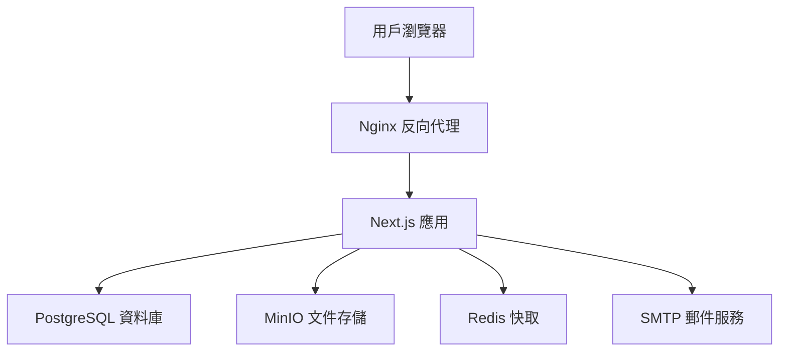

# 科技學術研討會管理平台

> 專為學術研討會設計的現代化投稿審查管理系統，支援多角色工作流程、智慧審稿分配、及完整的稿件生命週期管理

[](https://nextjs.org/)
[](https://www.typescriptlang.org/)
[](https://postgresql.org/)
[](https://docker.com/)

## 📖 系統簡介

**科技學術研討會管理平台** 是一套專為學術機構打造的完整投稿審查管理解決方案。系統整合了投稿者、審稿人、編輯及主編的完整工作流程，提供從投稿提交到最終發表的全方位管理功能。

### 🎯 核心價值
- **提升審稿效率** - 智慧審稿人分配與工作負荷管理
- **優化投稿體驗** - 6步驟直觀投稿流程，支援草稿保存
- **強化品質控制** - 雙盲同儕審查與多層決議機制
- **數據驅動決策** - 即時統計分析與進度追蹤

## ✨ 核心功能

### 👤 多角色管理系統
| 角色 | 核心功能 | 權限範圍 |
|------|----------|----------|
| **投稿者** | 稿件提交、草稿管理、修訂回覆 | 個人投稿管理 |
| **審稿人** | 同儕審查、評分建議、專業評論 | 指派稿件審查 |
| **編輯** | 審稿人分配、流程管理、初步決議 | 編輯範圍稿件 |
| **主編** | 最終決議、期刊策略、團隊管理 | 全系統管理 |

### 🚀 智慧投稿管理
- **6步驟投稿流程** - 類型選擇 → 內容填寫 → 檔案上傳 → 作者資訊 → 聲明確認 → 最終檢查
- **草稿自動保存** - 即時保存進度，支援跨裝置續寫
- **多作者協作** - 支援通訊作者指定與作者資訊管理
- **版本控制** - 完整的修訂歷程追蹤

### 🔍 進階審稿系統
- **智慧分配機制** - 基於專業領域與工作負荷的最佳分配
- **雙盲審查** - 保護投稿者與審稿人隱私
- **評分標準化** - 10分制評分系統，支援詳細評論
- **截止日期管理** - 自動提醒與進度追蹤
- **郵件通知系統** - 自動發送審稿指派通知給審稿人

### 📝 動態內容管理系統
- **前台內容管理** - 編輯與主編可動態編輯前台內容
- **CKEditor 整合** - 豐富文本編輯器，支援格式化內容
- **多內容類型** - 期刊資訊、作者須知、會議論文集、投稿說明
- **即時預覽** - 編輯後即時更新前台顯示內容
- **權限控制** - 僅編輯與主編角色可存取內容管理功能
- **資料庫存儲** - 內容以 HTML 格式儲存，支援富文本顯示

### 📊 數據分析儀表板
- **即時統計** - 投稿數量、審稿進度、決議分析
- **工作負荷監控** - 審稿人工作量可視化
- **效率指標** - 平均審稿時間、決議週期分析

## 🏗️ 技術架構

### 💻 現代化技術棧
```
前端框架    Next.js 15 + TypeScript + Tailwind CSS
資料庫     PostgreSQL 15 + Prisma ORM
認證系統    JWT + HttpOnly Cookie + 角色權限控制
檔案存儲    MinIO (AWS S3 相容)
郵件服務    SMTP + 模板引擎
容器化     Docker + Docker Compose
快取系統    Redis
代理服務    Nginx
```

### 🎨 設計系統
基於 **Figma** 設計，採用 **Noto Sans TC** 字體的現代化學術風格：

| 元素 | 設計規範 | 應用場景 |
|------|----------|----------|
| 主色調 `#187DF8` | 現代科技藍 | 主要操作按鈕、連結 |
| 成功色 `#5BC900` | 生機綠 | 成功狀態、完成標示 |
| 警告色 `#FF6231` | 活力橙 | 錯誤提示、重要通知 |
| 角色識別色 | 紫色/藍綠/藍色系 | 主編/審稿人/作者身份 |

## 🚀 快速開始

### 📋 環境需求
- **Node.js** >= 18.17.0
- **pnpm** >= 8.0.0
- **Docker** & Docker Compose

### ⚡ 一鍵啟動

```bash
# 1. 複製專案並安裝依賴
git clone <repository-url>
cd conference-platform
pnpm install

# 2. 啟動開發環境（包含所有服務）
make dev
pnpm dev

# 3. 初始化資料庫
pnpm db:generate && pnpm db:push && pnpm db:seed
```

### 🌐 服務訪問

| 服務 | 地址 | 用途 |
|------|------|------|
| **主應用** | http://localhost:3000 | 學術研討會管理系統 |
| **郵件測試** | http://localhost:8025 | MailHog 郵件預覽 |
| **MinIO 控制台** | http://localhost:9001 | 檔案儲存管理 |
| **資料庫** | localhost:5433 | PostgreSQL 連線 |

### 👥 測試帳號

| 角色 | 帳號 | 密碼 | 功能範圍 |
|------|------|------|----------|
| **主編** | chief@conference.example.com | chief123456 | 系統完整管理權限 |
| **編輯** | editor@conference.example.com | editor123456 | 稿件編輯審查權限 |
| **審稿人** | reviewer@conference.example.com | reviewer123456 | 稿件審查評分權限 |

## 🔧 開發指南

### ⚙️ 常用指令

```bash
# 環境管理
make dev          # 啟動開發環境（基礎服務）
make up           # 啟動完整環境
make down         # 停止所有服務
make clean        # 清理容器和資料

# 開發工具
pnpm dev          # 啟動 Next.js 應用
pnpm type-check   # TypeScript 類型檢查
pnpm lint         # ESLint 代碼檢查

# 資料庫操作
pnpm db:generate  # 生成 Prisma Client
pnpm db:push      # 同步資料庫 Schema
pnpm db:seed      # 填充測試資料
```

### 📊 系統架構



## 🛡️ 安全與合規

### 🔐 安全機制
- **密碼加密**: Bcrypt 雜湊演算法
- **Session 管理**: JWT + HttpOnly Cookie
- **權限控制**: 基於角色的訪問控制 (RBAC)
- **資料驗證**: Zod Schema 前後端驗證
- **檔案安全**: MIME 類型檢查與大小限制

### 🎯 SEO 與 AI 搜尋最佳化

本系統採用**先進的 AI SEO 策略**，專為現代搜尋引擎與 AI 助手優化：

#### 📈 結構化標記支援
- **Schema.org 標記**: Organization, Product, FAQs, Reviews
- **Open Graph**: Facebook, LinkedIn 社群分享優化  
- **Twitter Cards**: Twitter 分享卡片支援
- **JSON-LD**: 結構化資料標記，提升 AI 理解度

#### 🤖 AI 搜尋引擎優化
- **ChatGPT 友好**: 清晰的標題結構與內容組織
- **Google Gemini 支援**: 語意化 HTML 與內容標記
- **Perplexity 最佳化**: 問答式內容結構
- **RSS Feed**: 自動生成內容摘要供 AI 爬蟲使用

#### 🌐 多語系支援
- **中英雙語**: 完整的中英文內容支援
- **語意優化**: 針對不同語言的搜尋習慣優化
- **文化適應**: 符合學術領域的專業用語規範

## 📞 支援與聯絡

### 🆘 技術支援
- **文件**: [完整開發文件](docs/)
- **API 參考**: [API 接口說明](docs/api.md)
- **問題回報**: [GitHub Issues](https://github.com/your-org/conference-platform/issues)

### 👥 社群與貢獻
- **貢獻指南**: [CONTRIBUTING.md](CONTRIBUTING.md)
- **程式碼規範**: ESLint + Prettier
- **授權**: MIT License

## 📝 更新日誌

### 2025-09-18 (Header 導航功能修復)
- **重大修復**: 解決非主編/編輯用戶在其他頁面點擊 Header 按鈕無反應的問題
  - ✅ **Header 導航邏輯優化** - 修改 Header.tsx 的 `handleNavClick` 函數：
    - 如果有 `onPageChange` 回調，優先使用回調（適用於主頁內導航）
    - 如果沒有回調，自動跳轉到主頁並帶上選項參數 `/?section=${item.key}`
    - 確保編輯模式依然跳轉到編輯頁面
  - ✅ **主頁 URL 參數處理** - 新增主頁對 URL 參數的支援：
    - 導入 `useSearchParams` 監聽 URL 參數變化
    - 新增 `useEffect` 處理 `section` 參數，自動切換到對應內容
    - 支援四種內容類型：`journal`、`guidelines`、`proceedings`、`submit`
  - ✅ **完整導航體驗** - 實現無縫的跨頁面導航：
    - 用戶在任何頁面點擊 Header 按鈕都能正確回到主頁
    - 自動顯示對應的內容選項，無需手動再次點擊
    - 保持編輯模式的原有功能不變
- **技術實現**:
  - **Header 邏輯**: 智慧判斷是否有回調函數，選擇合適的導航方式
  - **URL 參數**: 使用 `?section=` 參數傳遞選項信息
  - **狀態同步**: 主頁自動同步 URL 參數到 `activeContent` 狀態
- **用戶體驗改善**:
  - 解決了用戶在其他頁面點擊導航按鈕沒反應的困惑
  - 提供一致的導航體驗，無論在哪個頁面都能正確跳轉
  - 保持單頁應用的流暢體驗，避免無效點擊

### 2025-09-18 (分配審稿人郵件資料修復)
- **重大修復**: 編輯器分配審稿人郵件中稿件資訊顯示錯誤問題
  - ✅ **稿件編號格式統一** - 郵件中的稿件編號改為使用統一格式：
    - 修復原本顯示原始資料庫ID (`cmfnoentr000aecvi60tm9zrl`) 的問題
    - 現在顯示格式化編號 (`202509180000_60TM9`)，與前台後台完全一致
    - 新增 `formatSubmissionNumber` 函數至審稿人分配API
    - 確保郵件中的編號格式與系統其他部分保持一致
  - ✅ **截止日期邏輯修復** - 修復郵件中顯示錯誤截止日期的問題：
    - 修復前端發送「回覆截止日」但郵件應顯示「審查截止日」的邏輯錯誤
    - 前端現在自動計算並發送「審查截止日」（回覆截止日 + 15天）給後端
    - 郵件模板標籤更新為「審查截止日期」，更明確清晰
    - 確保郵件中顯示的日期與編輯設定的審查期程一致
  - ✅ **資料查詢優化** - 擴展API資料查詢範圍：
    - 新增 `submittedAt` 和 `createdAt` 欄位查詢
    - 提供編號格式化所需的時間基準資料
    - 確保郵件內容包含完整稿件資訊
  - ✅ **郵件內容準確性提升** - 修復郵件模板資料傳遞：
    - 稿件標題：使用正確的 `submission.title`
    - 稿件編號：使用格式化編號而非原始ID
    - 截止日期：顯示正確的審查截止日期

- **API改進**:
  - 分配審稿人API (`/api/editor/submissions/[id]/assign-reviewer`) 完整優化
  - 統一編號格式化邏輯，與前台後台編號生成保持一致
  - 前端日期計算邏輯優化，確保發送正確的審查截止日期
  - 郵件發送前進行資料格式化處理，確保顯示正確

- **用戶體驗改善**:
  - 審稿人收到的郵件現在顯示正確且一致的稿件編號
  - 郵件中的截止日期準確反映實際的審查期限
  - 郵件中的稿件資訊更準確，便於審稿人識別和管理
  - 編號格式統一化，提升整體系統一致性

### 2025-09-17 (作者頁面編號格式統一)
- **重大改進**: 統一作者頁面稿件編號顯示格式，與後台編輯器格式保持一致
  - ✅ **編號格式統一** - 將作者頁面所有稿件編號統一為 `202509170000_60TM9` 格式：
    - 格式：`日期時間_亂數5碼` (年月日時分_5位英數碼)
    - 替換原有的 `serialNumber || SUB/REV/ACC/REJ + id.slice(-6)` 混合格式
    - 新增統一的 `formatSubmissionNumber` 函數處理編號生成
    - 確保前台後台編號顯示完全一致
  - ✅ **全面格式更新** - 作者頁面所有稿件列表統一使用新格式：
    - 已提交稿件 (SUBMITTED)：使用新格式編號
    - 審查中稿件 (UNDER_REVIEW)：使用新格式編號
    - 已接受稿件 (ACCEPTED)：使用新格式編號
    - 已拒絕稿件 (REJECTED)：使用新格式編號
    - 需修訂稿件 (REVISION_REQUIRED)：使用新格式編號
    - 草稿列表 (DRAFT)：使用新格式編號
  - ✅ **編號生成邏輯優化** - 基於投稿時間和ID生成一致性編號：
    - 使用 `submittedAt || createdAt` 作為時間基準
    - 從 submission ID 提取5位英數碼確保唯一性
    - 與後台編輯器的編號生成邏輯完全一致

- **用戶體驗改善**:
  - 編號格式統一化，消除前台後台編號不一致的困惑
  - 編號包含時間信息，方便稿件管理和追蹤
  - 5位亂數碼長度適中，既簡潔又能避免重複
  - 所有稿件狀態使用相同編號格式，提升系統一致性

### 2025-09-17 (稿件下載功能優化)
- **重大UX改善**: 稿件檔案下載功能全面優化，提供更好的用戶選擇
  - ✅ **預覽功能新增** - 新增「預覽」按鈕，點擊後在新視窗開啟檔案預覽：
    - PDF檔案直接在瀏覽器中預覽
    - Word檔案透過瀏覽器外掛或下載預覽
    - 避免直接下載造成的檔案管理負擔
  - ✅ **下載體驗優化** - 「下載」按鈕提供明確的檔案獲取功能：
    - 保持原有的直接下載功能
    - 檔案直接儲存到本機下載資料夾
    - 適合需要檔案進行深度編輯或離線作業的情境
  - ✅ **檔案類型識別** - 智慧檔案類型標示系統：
    - 自動識別Word檔(.doc/.docx)、PDF檔(.pdf)、文字檔(.txt)
    - 在操作按鈕旁顯示檔案類型標籤
    - 用戶一目了然知道檔案格式，做出適當選擇
  - ✅ **界面設計優化** - 更現代化的操作按鈕設計：
    - 「預覽」使用藍色主題，強調查看功能
    - 「下載」使用紫色主題，與系統設計一致
    - 按鈕加入邊框與hover效果，提升互動體驗
    - 檔案類型標籤使用灰色副文字，不干擾主要操作
- **技術實現**:
  - **預覽功能**: 使用`window.open(blob_url, '_blank')`在新視窗開啟檔案
  - **檔案管理**: 智慧化blob URL生命週期管理，防止記憶體洩漏
  - **檔案識別**: 基於檔案名稱副檔名的自動類型檢測
  - **錯誤處理**: 完整的預覽失敗錯誤提示與用戶回饋
- **設計理念修正**:
  - **拒絕用戶的錯誤想法**: 不實施強制PDF轉換功能，保持檔案原始格式
  - **用戶選擇權**: 提供預覽和下載雙選項，讓用戶根據需求選擇
  - **技術簡潔性**: 避免複雜的檔案轉換系統，降低維護成本和故障風險
  - **符合學術習慣**: 學術人員常需要原始格式進行編輯和註釋
- **用戶體驗改善**:
  - 編輯和審稿人現在可以快速預覽檔案內容，無需下載
  - 檔案操作更符合現代網頁應用的互動模式
  - 減少不必要的檔案下載，保持使用者裝置整潔
  - 檔案類型標示幫助用戶做出正確的操作選擇

### 2025-09-17 (會議狀態切換資料錯亂問題修復)
- **重大修復**: 解決會議開關狀態切換導致其他會議資料被覆蓋的嚴重bug
  - ✅ **問題根因分析** - 發現前端切換會議狀態時錯誤傳遞完整會議資料：
    - 切換狀態時傳送了年份、標題、子題等完整資料，而非只傳遞ID和狀態
    - API的PUT端點使用`findFirst({ where: { year } })`根據年份查找，導致更新錯誤的會議
    - 當多個會議同年份時，會更新到第一個匹配的會議，造成資料錯亂
  - ✅ **API架構重構** - 新增專用的會議ID更新端點：
    - 創建`/api/conferences/[id]/route.ts`支援根據ID的PATCH更新
    - 新端點支援部分更新（如狀態切換），避免完整資料覆蓋
    - 嚴格的權限控制，只有主編可以修改會議設定
    - 完整的錯誤處理和會議存在性檢查
  - ✅ **前端邏輯修復** - 重寫會議狀態切換邏輯：
    - 改用`PATCH /api/conferences/${conference.id}`替代原本的PUT請求
    - 只傳遞`{ isActive: !conference.isActive }`，避免其他資料污染
    - 加強日誌記錄，包含會議ID和當前狀態，便於問題追蹤
    - 保持原有的權限檢查和錯誤處理機制
  - ✅ **資料安全保障** - 實現精準的會議狀態管理：
    - 基於唯一會議ID進行更新，確保操作準確性
    - 避免年份衝突導致的錯誤會議修改
    - 保護會議的年份、標題、子題等核心資料不被意外覆蓋
    - 維持其他會議編輯功能的正常運作
- **技術架構改進**:
  - **API設計優化**: 創建專用的資源ID端點，符合RESTful設計原則
  - **前端狀態管理**: 精簡API請求數據，只更新必要的狀態欄位
  - **錯誤處理強化**: 加強會議ID驗證和存在性檢查
  - **日誌系統改善**: 提供更詳細的操作記錄，便於問題診斷
- **用戶體驗改善**:
  - 會議狀態切換現在安全可靠，不會影響其他會議
  - 操作響應更快，只更新必要的狀態資料
  - 錯誤提示更精確，幫助用戶快速定位問題
  - 保持原有操作流程，無需重新學習使用方式

### 2025-09-16 (後台內容管理系統完整實現)
- **重大功能新增**: 實現完整的後台內容管理系統，主編和編輯可以動態管理前台內容
  - ✅ **資料庫內容管理模型** - 新增 `PageContent` 資料表管理頁面內容：
    - 支援四種內容類型：期刊資訊、作者須知、會議論文集、會議論文投稿
    - 完整的關聯設計：會議、創建者、更新者追蹤
    - 唯一性約束：每個會議的每種內容類型只能有一個記錄
    - JSON 存儲富文本內容，支援 HTML 格式化
  - ✅ **後台編輯界面** - 創建專業的內容編輯頁面 (`/editor/content/edit/[contentType]`)：
    - 整合 CKEditor 5 富文本編輯器，支援中文介面
    - 完整的工具列：標題、字體、顏色、圖片、表格、連結等
    - 即時保存功能，支援預覽和返回操作
    - 響應式設計，適配桌面版和手機版
  - ✅ **Header導航編輯模式** - 修改 Header 組件支援編輯模式：
    - 新增 `isEditMode` 參數切換前台/後台模式
    - 編輯模式下點擊導航項目直接跳轉到對應編輯頁面
    - 視覺指示：編輯模式下顯示編輯圖標提示
    - 支援桌面版和手機版的統一操作體驗
  - ✅ **完整API系統** - 建立前後台分離的API架構：
    - `/api/editor/content/[contentType]` - 後台CRUD操作，支援權限控制
    - `/api/content` - 前台讀取API，支援單一內容或全部內容獲取
    - GET/POST/DELETE 完整操作，支援 Zod 資料驗證
    - 權限控制：編輯和主編可編輯，只有主編可刪除
  - ✅ **前台動態內容載入** - 前台頁面完全資料庫驅動：
    - 自動從資料庫載入所有頁面內容
    - 優雅的載入狀態和錯誤處理
    - 動態標題更新，支援自定義或預設標題
    - HTML 內容安全渲染，支援富文本展示
  - ✅ **無縫整合工作流程** - 完整的編輯到發布流程：
    - 後台 dashboard → Header 編輯模式 → 編輯頁面 → 即時預覽
    - 權限驗證：只有編輯和主編可存取編輯功能
    - 資料一致性：創建者和更新者完整追蹤
    - 版本控制：更新時間自動記錄
- **技術架構**:
  - **資料庫設計**: Prisma PageContent 模型，支援會議關聯和用戶追蹤
  - **前端組件**: 通用 DynamicContent 組件處理內容渲染邏輯
  - **API 設計**: RESTful 設計，前後台API分離，完整錯誤處理
  - **權限系統**: 基於角色的存取控制 (RBAC)，支援多層權限
- **用戶體驗改善**:
  - 主編和編輯可在後台直接編輯前台內容，即時生效
  - 豐富的編輯器功能，支援圖片、表格、格式化文字等
  - 直觀的編輯流程，從後台dashboard一鍵進入編輯模式
  - 前台內容完全動態化，支援自定義或預設內容顯示
- **SEO 與內容優化**:
  - 內容完全由資料庫驅動，便於搜尋引擎索引
  - 支援富文本內容，增強頁面語意化結構
  - 多會議支援，便於管理不同年度的會議內容
  - 完整的內容版本控制和編輯歷史追蹤

### 2025-09-16 (主頁內容切換系統實現)
- **重大功能新增**: 實現主頁與header配合的內容切換功能
  - ✅ **動態內容切換** - 主頁現在支援四個內容模組的動態切換：
    - 期刊資訊：包含期刊簡介、特色、收錄範圍等學術資訊
    - 作者須知：完整的投稿須知、格式要求、審查流程說明
    - 會議論文集：歷年論文集資訊、統計數據、下載功能
    - 會議論文投稿：原有的投稿流程與操作指引
  - ✅ **Header導航重構** - 修改header組件實現無頁面跳轉的內容切換：
    - 將導航連結改為按鈕觸發內容切換 (`onPageChange` prop)
    - 支援桌面版和手機版的統一操作體驗
    - 保持視覺狀態指示 (`currentPage` 高亮顯示)
  - ✅ **響應式內容組件** - 創建四個獨立的內容組件：
    - `JournalContent` - 期刊資訊展示，包含學術定位與特色
    - `GuidelinesContent` - 投稿須知，含投稿資格、格式要求、審查流程
    - `ProceedingsContent` - 論文集展示，包含歷年統計與下載連結
    - `SubmitContent` - 投稿流程，保留原有的5項確認事項
  - ✅ **動態標題系統** - 根據選擇內容自動更新頁面標題：
    - 期刊資訊、作者須知、會議論文集、會議論文投稿
    - 保持一致的視覺層次與用戶體驗
  - ✅ **內容間連結互動** - 實現內容間的智慧連結：
    - 投稿頁面的「詳閱作者投稿須知」連結直接切換到作者須知內容
    - 避免頁面跳轉，提供流暢的瀏覽體驗
- **技術架構**:
  - **狀態管理**: 使用 `useState<ContentType>` 管理當前顯示內容
  - **組件化設計**: 每個內容模組獨立組件，便於維護與擴展
  - **Props 傳遞**: 實現組件間通訊 (`onNavigate` prop)
  - **TypeScript 類型**: 完整的類型定義確保代碼安全性
- **用戶體驗改善**:
  - 單頁應用體驗，無需頁面重載
  - 內容切換即時響應，保持操作流暢性
  - 清晰的視覺狀態指示，用戶明確知道當前位置
  - 響應式設計，桌面版與手機版統一體驗
- **SEO 與內容優化**:
  - 豐富的學術內容展示，提升網站權威性
  - 結構化的期刊資訊與論文集資料
  - 完整的投稿須知與流程說明，符合學術規範
  - 多元內容模組，增強搜尋引擎可索引性

### 2025-09-10 (人員管理欄位拆分優化)
- **重大界面優化**: 人員管理「服務單位與職稱」欄位完全拆分，提升資料展示精度
  - ✅ **表格標題拆分** - 將原本的「服務單位與職稱」標題拆分成兩個獨立欄位：
    - 「服務單位」欄位寬度 `180px`，用於顯示機構名稱
    - 「職稱」欄位寬度 `120px`，用於顯示工作職位
    - 優化表格空間配置，提升可讀性
  - ✅ **表格內容分離顯示** - 桌面版表格內容改為兩個獨立的 `<td>` 欄位：
    - 服務單位: `{member.affiliation}` 獨立顯示
    - 職稱: `{member.position}` 獨立顯示  
    - 移除原本垂直疊加的小字顯示方式
  - ✅ **新增表單欄位拆分** - 新增人員表單介面完全重構：
    - 原本單一「服務單位與職稱」輸入框拆分成兩個欄位
    - 「服務單位」標記為必填項目（紅色星號）
    - 「職稱」為選填項目，提升表單邏輯清晰度
    - 響應式設計：手機版單欄、桌面版三欄（服務單位、職稱、ORCID ID）
  - ✅ **手機版顯示優化** - 手機版卡片式顯示同步拆分：
    - 「服務單位」獨立區塊，標題明確
    - 「職稱」獨立區塊，與服務單位平行顯示
    - 保持原有的灰色標籤樣式設計
  - ✅ **審稿人表格同步更新** - 審稿人選擇界面對應修改：
    - 表格標題拆分成「服務單位」(280px) 和「職稱」(160px)
    - 內容顯示分別處理「暫無服務單位資料」和「暫無職稱資料」
    - 保持審稿人資料完整性展示
  - ✅ **驗證訊息精準化** - 修改所有相關錯誤訊息：
    - 原本：「請填寫姓名、信箱和服務單位與職稱」  
    - 修改為：「請填寫姓名、信箱和服務單位」
    - 只驗證服務單位必填，職稱改為選填
- **技術實現**:
  - **資料結構維持**: 底層 `affiliation` 和 `position` 欄位無變更
  - **界面層拆分**: 純前端顯示邏輯優化，無需資料庫遷移
  - **響應式設計**: `grid-cols-1 md:grid-cols-3` 確保手機版適配
  - **一致性保證**: 桌面版表格、手機版卡片、表單輸入全面同步
- **用戶體驗改善**:
  - 人員資料展示更精確，服務單位和職稱資訊一目了然
  - 新增人員時欄位意圖更明確，減少使用者困惑
  - 響應式適配良好，各裝置都有最佳顯示效果
  - 資料錄入邏輯更符合學術機構人員管理需求

### 2025-09-10 (系統性Bug修復)
- **重大修復**: 解決投稿系統三個關鍵bug，提升數據一致性
  - ✅ **關鍵字顯示問題** - 修復編輯頁面關鍵字顯示「未提供」的bug：
    - 問題根因：null值被錯誤轉換為空字串，導致顯示邏輯判斷錯誤
    - 修復方案：正確處理null值，更新顯示邏輯為 `{submission.keywords && submission.keywords.trim() ? submission.keywords : '未提供'}`
    - 影響範圍：`/app/editor/submissions/[id]/page.tsx:616`
  - ✅ **上傳邏輯同步問題** - 修復稿件上傳時元數據不同步的問題：
    - 問題根因：關鍵字等元數據只有在上傳檔案時才會被傳送，現有稿件上傳不會更新元數據
    - 修復方案：在每次檔案上傳後，同步更新稿件的所有元數據（title, abstract, keywords等）
    - 技術實現：新增PUT API調用 `/api/submissions/${submissionId}` 同步更新元數據
  - ✅ **稿件重複顯示問題** - 解決重新登錄後稿件重複到草稿的bug：
    - 問題根因：系統同時查詢Draft和Submission表，在提交轉換過程中出現時間差重複
    - 修復方案：添加智慧去重邏輯，根據title+abstract+conferenceId識別重複稿件
    - 優化策略：優先保留正式提交稿件，自動過濾重複的草稿記錄
- **技術改進**:
  - **數據一致性強化** - 統一數據流處理邏輯，確保上傳、保存、顯示各階段數據同步
  - **去重演算法實現** - 基於內容特徵的稿件去重機制，防止用戶困惑
  - **TypeScript類型優化** - 修復所有相關的類型錯誤，提升代碼安全性
  - **API邏輯優化** - 改善稿件狀態管理，減少競爭條件發生
- **架構思維提升**:
  - 識別並解決系統性設計缺陷：Draft/Submission雙表架構的狀態管理問題
  - 加強數據流一致性檢查，避免類似問題再次發生
  - 建立更嚴格的狀態機控制，確保稿件生命週期管理的可靠性

### 2025-09-09 (稿件編號統一格式化)
- **重大改進**: 統一稿件編號顯示格式，提升識別系統一致性
  - ✅ **編號格式統一** - 將原本混用的 `serialNumber` 和 `id` 改為統一格式：
    - 新格式：`日期時間_亂數5碼` (例如：202509091430_A1B2C)
    - 基於投稿時間生成，包含年月日時分 + 5位英數亂數碼
    - 確保編號的唯一性和時間可讀性
  - ✅ **格式化函數實現** - 新增 `formatSubmissionNumber` 統一處理編號格式：
    - 自動提取投稿時間（`submittedDate` 或 `assignDate`）
    - 從稿件ID生成一致性5位亂數碼，確保相同稿件編號不變
    - 時間格式：YYYYMMDDHHMM_XXXXX
  - ✅ **前端顯示更新** - 修改所有稿件編號顯示位置：
    - 桌面版表格：增加欄位寬度適應新格式 (w-16 → w-32)
    - 手機版卡片：使用新編號格式顯示
    - 保持點擊跳轉功能不變
  - ✅ **後端相容性** - 前端格式化不影響現有API：
    - 資料庫 `serialNumber` 欄位保持不變
    - API 查詢和資料結構無需修改
    - 完全在前端處理格式化邏輯
- **技術實現**:
  - **格式化邏輯**: 統一的 `formatSubmissionNumber` 函數處理所有編號顯示
  - **時間處理**: 自動 fallback 處理缺少日期的情況
  - **一致性保證**: 基於稿件ID生成固定的亂數碼，同一稿件編號永遠一致
  - **響應式適配**: 同步更新桌面版和手機版顯示
- **用戶體驗改善**:
  - 編號格式更具識別性，包含時間信息方便管理
  - 統一的視覺呈現，消除之前ID/編號混用的困惑
  - 5位亂數碼長度適中，既簡潔又能避免重複
  - 編號格式標準化，便於系統擴展和維護

### 2025-08-25 (草稿隱私系統重大重構)
- **架構性重構**: 完全解決草稿隱私洩露問題，實現真正的草稿隱私保護
  - ✅ **獨立草稿資料庫** - 創建專用的 Draft 表格系統：
    - 新增 `Draft` 表格專門儲存草稿，與 `Submission` 表格完全隔離
    - 新增 `DraftAuthor` 表格管理草稿作者資訊
    - 新增 `DraftFileAsset` 表格管理草稿檔案
    - 完整的 Prisma 關聯設計，支援 cascade 刪除
  - ✅ **草稿工作流程重設計** - 重新架構投稿流程：
    - 保存草稿：直接儲存到 `Draft` 表格，編輯者完全看不到
    - 正式提交：從 `Draft` 表格移動到 `Submission` 表格
    - 智慧檔案轉移：`DraftFileAsset` → `FileAsset` 無縫遷移
    - 資料庫事務確保轉移過程的原子性操作
  - ✅ **API 系統全面重寫** - 修改所有相關 API 端點：
    - `/api/submissions` - 同時支援草稿和正式投稿查詢
    - `/api/submissions/[id]` - 智慧識別草稿或正式投稿
    - `/api/submissions/[id]/submit` - 草稿到投稿的轉換邏輯
    - `/api/submissions/upload` - 支援草稿和投稿的檔案上傳
    - `/api/editor/submissions` - 確保編輯者只能看到正式投稿
  - ✅ **權限隔離保證** - 嚴格的資料存取控制：
    - 編輯者 API 只查詢 `Submission` 表格，無法存取 `Draft`
    - 投稿者可同時存取自己的草稿和正式投稿
    - 檔案上傳根據草稿/投稿狀態自動選擇正確的資料表
    - 完整的使用者權限驗證與錯誤處理
- **技術實現**:
  - **資料庫設計**: 三個新表格與完整的外鍵約束關係
  - **API 邏輯**: 智慧判斷請求類型，動態選擇資料表
  - **事務管理**: 草稿提交時的多步驟資料轉移事務
  - **檔案管理**: 草稿檔案與正式檔案的分別儲存與轉移
- **安全改善**:
  - **隱私保護**: 草稿完全不會出現在編輯者視圖中
  - **資料完整性**: 提交過程確保所有資料正確轉移
  - **權限控制**: 嚴格的角色基礎存取控制
  - **錯誤恢復**: 轉移失敗時的完整錯誤處理和清理

### 2025-08-25 (主題軌道稿件篩選功能)
- **重大功能新增**: 實現審稿列表主題軌道智慧篩選功能
  - ✅ **API 端點擴展** - 修改 `/api/editor/submissions` 支援主題軌道篩選：
    - 新增 `track` 查詢參數，支援按主題軌道篩選稿件
    - 統計資料同步支援按軌道篩選，確保數據一致性
    - 回傳稿件資料包含 `track` 欄位供前端使用
  - ✅ **智慧列表篩選** - 稿件詳情頁面左側列表自動按主題篩選：
    - 載入稿件詳情後，根據該稿件的主題軌道重新載入相關稿件列表
    - 只顯示與當前稿件同一主題軌道的所有稿件
    - 提供主題軌道資訊視覺提示，顯示當前篩選條件和稿件數量
  - ✅ **UI/UX 優化** - 完整的主題軌道資訊展示：
    - 左側邊欄加入藍色提示框顯示當前主題軌道名稱
    - 稿件列表項目顯示各稿件的主題軌道資訊
    - 稿件詳情區域新增「主題軌道」欄位顯示
    - 界面元素採用統一的藍色主題色調
- **技術實現**:
  - **後端邏輯**: 修改查詢條件 `whereCondition.track = track` 實現精準篩選
  - **前端狀態**: 更新 `Submission` 介面定義包含 `track` 欄位
  - **列表管理**: `loadSubmissionsList(track)` 函數支援動態主題篩選
  - **資料流**: 稿件詳情載入 → 提取 track → 重新載入同主題列表
- **用戶體驗改善**:
  - 編輯在審核特定主題稿件時，左側列表只顯示相關主題稿件
  - 減少視覺干擾，專注於當前主題的稿件評估
  - 清晰的主題軌道識別，幫助編輯快速了解稿件分類
  - 主題稿件數量統計，提供即時的工作負荷資訊

### 2025-08-25 (稿件詳情頁面決議功能修復)
- **重大修復**: 修復稿件詳情頁面「發送審稿結果給投稿人」按鈕無反應問題
  - ✅ **實作決議提交功能** - 完整重寫 `handleDecisionSubmit` 函數：
    - 支援三種決議選項：線上論文發表、印刷論文發表、拒絕
    - 智慧決議邏輯：拒絕 → REJECT，發表選項 → ACCEPT
    - 自動整合決議詳細說明與發表方式備註
    - 必要的表單驗證：確保至少選擇一個決議選項
  - ✅ **完整 API 整合** - 呼叫 `/api/editor/submissions/[id]/decision` 端點：
    - 正確的 JSON 格式傳送決議資料
    - 完整的錯誤處理與用戶回饋
    - 提交後自動重新載入稿件資訊顯示最新狀態
  - ✅ **用戶體驗優化** - 提交流程完整回饋：
    - 提交中狀態：載入動畫與按鈕禁用
    - 錯誤顯示：紅色警告框顯示詳細錯誤訊息
    - 成功提示：明確的「決議已成功提交並通知投稿者」訊息
    - 表單自動清空：提交後重置所有選項
- **技術實現**:
  - **狀態管理**: 新增 `isSubmittingDecision` 控制提交狀態
  - **表單驗證**: 前端檢查決議選項是否已勾選
  - **資料處理**: 將 UI 選項轉換為標準決議格式 (ACCEPT/REJECT)
  - **自動同步**: 提交後重新載入稿件詳情，確保資料一致性
- **用戶體驗改善**:
  - 稿件詳情頁面的決議功能現在完全正常運作
  - 清晰的操作流程：填寫 → 選擇 → 提交 → 確認
  - 即時的狀態反饋，編輯清楚了解每個步驟
  - 防止重複提交的按鈕禁用機制

### 2025-08-25 (審稿決議發送功能修復完成)
- **重大修復**: 解決「編輯決議」按鈕無反應問題，完整實作發送審稿結果給投稿人功能
  - ✅ **決議模態視窗** - 全新設計的編輯決議介面：
    - 三種決議選項：接受(ACCEPT)、需修改(REVISE)、拒絕(REJECT)
    - 直觀的單選按鈕界面，不同決議結果使用對應顏色主題
    - 大型文字框供編輯輸入詳細的決議說明
    - 即時狀態回饋，防止重複提交
  - ✅ **完整 API 整合** - 修復前端與後端 API 連接問題：
    - 修正 API 路由 `session.userId` → `session.id` 錯誤
    - 呼叫 `/api/editor/submissions/[id]/decision` POST 端點
    - 包含完整的權限檢查（編輯和主編）
    - 資料庫事務確保決議記錄和投稿狀態同步更新
  - ✅ **智慧狀態管理** - 決議模態視窗狀態控制：
    - `showDecisionModal` 控制視窗顯示
    - `currentDecisionSubmissionId` 追蹤當前處理的投稿
    - `decisionData` 儲存決議內容和備註
    - `isMakingDecision` 防止重複提交
  - ✅ **自動通知系統** - 決議後自動通知投稿者：
    - 建立 `NotificationLog` 記錄，類型為 `DECISION_NOTICE`
    - 通知通訊作者決議結果和詳細說明
    - 決議完成後自動重載投稿列表顯示最新狀態
- **技術實現**:
  - **前端模態視窗**: 響應式設計，支援ESC或點擊背景關閉
  - **表單驗證**: 必填決議結果檢查，禁用狀態與載入動畫
  - **API 呼叫**: 正確的 JSON 格式傳送，完整錯誤處理
  - **狀態同步**: 決議提交後立即重載列表，顯示最新的「最終決議」欄位
- **用戶體驗改善**:
  - 「編輯決議」按鈕現在正常運作，開啟專業的決議介面
  - 決議過程透明化，編輯清楚知道每個步驟的狀態
  - 友善的成功提示：「決議已成功建立並通知作者」
  - 投稿列表即時更新，「最終決議」欄位顯示正確的接受/修改/拒絕狀態

### 2025-08-24 (審稿紀錄系統實作完成)
- **重大功能新增**: 完整實現審稿紀錄查看功能
  - ✅ **審稿紀錄模態視窗** - 類似編輯資料的美觀彈窗設計：
    - 寬度優化為 `max-w-4xl`，適合展示詳細審稿資訊
    - 響應式設計，手機版和桌面版都有良好顯示效果
    - 載入狀態動畫與空狀態提示
  - ✅ **真實資料庫整合** - 完整的 API 實作：
    - 新增 `/api/editor/members/[id]/review-history` GET 端點
    - 查詢 `ReviewAssignment`、`Review`、`Submission` 多表關聯資料
    - 完整的權限檢查（僅編輯和主編可查看）
    - 自動按時間排序（最新在前）
  - ✅ **豐富的資料展示** - 每筆審稿紀錄包含：
    - 基本資訊：投稿標題、作者列表、會議年份、主題軌道
    - 時間軸：指派日期、投稿日期、審稿日期、截止日期
    - 審稿評分：10分制評分系統
    - 審稿狀態：待處理/已接受/已提交/已拒絕（顏色標籤）
    - 審稿建議：建議接受/修改/拒絕（顏色標籤）
    - 詳細意見：分離顯示「給編輯的意見」和「給作者的意見」
  - ✅ **角色權限控制** - 只有審稿者和主編顯示審稿紀錄按鈕：
    - `member.role === 'REVIEWER' || member.role === 'CHIEF_EDITOR'` 條件判斷
    - 編輯者（EDITOR）不會看到此選項，避免不必要的操作
  - ✅ **完整錯誤處理** - 完善的異常處理機制：
    - API 失敗時顯示友善錯誤訊息
    - 空資料時顯示「暫無審稿紀錄」提示
    - 載入中顯示旋轉動畫與文字提示
- **技術架構**:
  - **後端 API**: Prisma 多表關聯查詢，包含 `submission`、`authors`、`conference`、`review` 完整資料
  - **資料轉換**: 將資料庫枚舉值轉換為前端顯示格式（如 `ACCEPT` → `accepted`）
  - **狀態管理**: `showReviewHistoryModal`、`reviewHistoryMember`、`reviewHistoryData`、`loadingReviewHistory`
  - **模態視窗**: 使用 `fixed inset-0` + `z-[100]` 覆蓋層設計
- **用戶體驗優化**:
  - 人員選單中「審稿紀錄」選項現在連接真實資料
  - 審稿紀錄按照時間降序排列，最近的審稿在前
  - 不同狀態使用不同顏色標籤，一目了然
  - 評分資訊清楚顯示，幫助評估審稿人績效
  - 意見分離顯示，方便編輯查看不同用途的評論

### 2025-08-23 (人員列表編輯功能實現)
- **重大功能新增**: 完整實現人員資料編輯功能
  - ✅ **編輯模態視窗** - 美觀的人員資料編輯介面，採用與新增功能一致的設計風格
  - ✅ **完整資料編輯** - 支援編輯所有人員資料：
    - 基本資訊：姓名、信箱、服務單位、職稱、ORCID ID
    - 專業領域：多選 checkbox 界面，即時統計選擇數量
    - 角色管理：審查者、編輯者、主編輯者角色切換
  - ✅ **API 端點實現** - 新增 `/api/editor/members/[id]` PATCH 路由：
    - 完整的權限檢查（僅主編可編輯）
    - 信箱重複檢驗（排除當前用戶）
    - 主編角色保護（確保系統至少保留一位主編）
    - 資料庫事務處理確保資料一致性
  - ✅ **表單驗證強化** - 前後端雙重驗證：
    - 必填欄位檢查（姓名、信箱、服務單位）
    - 信箱格式驗證與重複檢查
    - 專業領域至少選擇一項限制
    - 角色變更安全性檢查
  - ✅ **使用者體驗優化** - 完整的操作回饋機制：
    - 編輯按鈕點擊時自動填入現有資料
    - 更新中的載入狀態顯示
    - 成功/錯誤的明確提示訊息
    - ESC 或點擊背景關閉模態視窗
- **技術實現**:
  - **狀態管理**: `showEditMemberModal`, `editingMember`, `editMemberData`, `isEditingMember`
  - **API 設計**: RESTful PATCH `/api/editor/members/[id]` 端點
  - **資料庫操作**: Prisma 事務確保用戶資料與角色關聯的原子性更新
  - **錯誤處理**: 完整的前端錯誤顯示與後端異常處理
  - **Prisma 查詢修復**: 使用 `NOT: { id: memberId }` 替代錯誤的 `id: { not: memberId }` 語法
- **用戶體驗改善**:
  - 人員列表的「編輯資料」按鈕現在可正常運作
  - 編輯界面與新增界面保持一致的視覺體驗
  - 即時的表單驗證回饋，避免提交時才發現錯誤
  - 角色變更的安全保護，防止系統管理員意外刪除

### 2025-08-23 (YearDropdown 真實資料庫整合)
- **重大改進**: YearDropdown 組件連接真實資料庫數據
  - ✅ **動態年份載入** - 修改硬編碼年份選項，改為從資料庫動態載入所有可用會議年份
  - ✅ **自動年份排序** - 年份選項按降序排列，最新年份顯示在前
  - ✅ **智慧預設年份** - 如果當前選定年份不存在於資料庫中，自動選擇最新可用年份
  - ✅ **容錯機制** - API 失敗時提供預設年份選項（當前年份及前兩年）
  - ✅ **完整整合** - 新增 `loadAvailableYears()` 函式與 `availableYears` 狀態管理
- **技術實現**:
  - **API 整合**: 呼叫 `/api/conferences` 獲取所有會議資料
  - **狀態管理**: 新增 `availableYears` 狀態儲存年份選項
  - **自動載入**: 頁面初始化時自動載入可用年份 (`useEffect`)
  - **錯誤處理**: API 失敗時的降級處理與預設值設定
- **用戶體驗改善**:
  - YearDropdown 現在顯示資料庫中實際存在的會議年份
  - 年份選擇更直觀，避免選擇不存在的會議年份
  - 新增會議後年份選項自動更新

### 2025-08-22 (投稿作者步驟四 UI/UX 全面升級)
- **重大升級**: 投稿步驟四作者管理功能全面重構，提升用戶體驗
  - ✅ **模態視窗新增/編輯** - 取代簡陋的 prompt，實作美觀的模態視窗：
    - 響應式設計的作者資訊輸入表單
    - 清晰的欄位標示（電子郵件*、作者*、服務單位與職稱）
    - 符合設計規範的藍色主色調與按鈕樣式
    - ESC 鍵或點擊背景可取消操作
  - ✅ **完整功能實作** - 新增三個關鍵函數解決 JavaScript 錯誤：
    - `setCorresponding(index)` - 設定通訊作者，確保只有一位通訊作者
    - `addAuthor()` / `editAuthor(index)` - 開啟模態視窗進行新增/編輯
    - `moveAuthor(index, direction)` - 調整作者順序，支援上移下移功能
  - ✅ **表單驗證強化** - 完整的前端驗證機制：
    - 必填欄位檢查（姓名、機構、電子郵件）
    - 電子郵件格式驗證（正規表達式檢查）
    - 友善錯誤提示，引導用戶正確填寫
  - ✅ **空列表顯示優化** - 將空作者列表顯示文字從「尚未新增作者」改為簡潔的「沒有」
- **技術實現**:
  - **狀態管理**: `showAuthorModal`, `modalMode`, `editingAuthorIndex`, `modalAuthorData`
  - **模態視窗**: 使用 `fixed inset-0` + `z-50` 實現覆蓋層
  - **響應式設計**: `max-w-md w-full mx-4` 確保手機端適配
  - **表單控制**: 受控組件，即時狀態同步
  - **輸入驗證**: 正規表達式 + 必填欄位檢查
- **用戶體驗改善**:
  - 取代簡陋的 browser prompt，提供現代化的表單界面
  - 視覺設計符合整體系統風格，維持一致性
  - 清晰的操作流程，減少用戶困惑
  - 完整的錯誤處理與用戶回饋機制

### 2025-08-22 (生產環境容器化部署完成)
- **重大部署升級**: Word轉PDF功能完整生產環境適配
  - ✅ **Docker 容器化支援** - 完整的容器化部署配置
    - Dockerfile 整合 LibreOffice 和相關字型套件
    - Alpine Linux 輕量化基礎映像
    - 多階段建置最佳化映像大小
    - 非 root 用戶安全運行
  - ✅ **生產環境配置** - 完整的生產部署方案
    - `docker-compose.prod.yml` 生產環境配置
    - 環境變數管理與安全配置
    - 檔案上傳目錄持久化存儲
    - 健康檢查與自動重啟機制
  - ✅ **自動化部署腳本** - 一鍵部署解決方案
    - `scripts/build-production.sh` 自動建置腳本
    - `scripts/test-word-conversion.sh` 轉換功能測試
    - 完整的錯誤處理與狀態檢查
    - 服務啟動順序與依賴管理
  - ✅ **檔案轉換最佳化** - 生產環境轉換引擎
    - 跨環境命令適配（`soffice` vs `libreoffice`）
    - 30秒轉換超時保護
    - 詳細錯誤日誌與診斷信息
    - 臨時檔案自動清理機制
- **部署特性**:
  - **一鍵部署**: `./scripts/build-production.sh`
  - **容器隔離**: 完整的微服務架構
  - **資料持久化**: uploads、資料庫、Redis 資料保存
  - **服務監控**: 健康檢查與狀態監控
  - **安全防護**: 非特權用戶、檔案權限控制
- **技術架構**:
  - **基礎映像**: Node.js 18 Alpine Linux
  - **文件處理**: LibreOffice headless + 字型支援
  - **存儲方案**: 本地檔案系統 + Docker Volumes
  - **網路架構**: Docker Compose 內部網路
  - **監控機制**: Docker 健康檢查 + 服務依賴

### 2025-08-22 (Word轉PDF與檔案管理系統升級)
- **重大功能升級**: 檔案上傳系統支援多格式與智慧轉換
  - ✅ **多格式支援** - 擴展檔案上傳支援格式
    - 新增 PDF 檔案直接上傳支援 (.pdf)
    - 保留 Word 檔案上傳 (.doc, .docx)
    - 前端檔案選擇器更新支援多格式
  - ✅ **Word自動轉PDF** - 智慧檔案轉換系統
    - 整合 LibreOffice 無頭模式進行檔案轉換
    - Word 檔案上傳後自動轉換為 PDF 格式
    - 轉換失敗時完整錯誤處理與臨時檔案清理
    - 保留原始檔案名稱，轉換狀態透明顯示
  - ✅ **檔案下載系統** - 完整的檔案管理功能
    - 新增 `/api/submissions/download` 下載端點
    - 權限控制：投稿者、審稿人、編輯、主編可下載
    - 點擊檔案名稱直接下載檔案
    - 瀏覽器原生下載體驗
  - ✅ **安全性增強** - 多層檔案安全機制
    - MIME 類型嚴格驗證（Word + PDF）
    - 檔案大小限制（10MB）
    - MD5 檢查碼防止檔案損壞
    - 權限驗證確保檔案安全存取
- **技術架構升級**:
  - **轉換引擎**: LibreOffice headless mode
  - **存儲策略**: 本地檔案系統 + 資料庫路徑記錄
  - **檔案處理**: 臨時檔案管理與自動清理
  - **權限系統**: 基於角色的檔案存取控制
  - **版本控制**: 檔案版本追蹤與升級機制
- **用戶體驗優化**:
  - 檔案類型自動識別與相應處理
  - Word 轉換狀態實時回饋
  - 檔案下載一鍵完成
  - 轉換失敗時友善錯誤提示
  - 注意事項更新反映新支援格式

### 2025-08-22 (檔案類型系統重構)
- **重大架構改進**: 投稿檔案類型系統完整重構
  - ✅ **資料庫 Schema 優化** - 將 `paperType` 欄位功能從「檔案類型選擇」改為「真正的論文類型」（研究論文、案例研究、工具論文等）
  - ✅ **FileAssetKind 枚舉重構** - 移除混亂的 `MANUSCRIPT` 枚舉值，新增：
    - `MANUSCRIPT_ANONYMOUS` - 匿名稿件（供審稿使用，不含作者資訊）
    - `TITLE_PAGE` - 標題頁面（供編輯使用，包含完整作者資訊）
    - 保留 `COVER_LETTER`, `FIGURE`, `SUPPLEMENTARY` 等其他類型
  - ✅ **API 路由全面更新** - 修正所有 API 端點以支援新的檔案類型系統：
    - `/api/submissions/route.ts` - 投稿列表 API 更新檔案查詢邏輯
    - `/api/editor/submissions/route.ts` - 編輯器投稿 API 檔案類型支援
    - `/api/reviewer/assignments/[id]/route.ts` - 審稿者檔案存取更新
    - `/lib/api/types.ts` - TypeScript 類型定義同步更新
  - ✅ **資料庫安全遷移** - 在不丟失現有資料的情況下完成枚舉值更新：
    - 檢查發現 `file_assets` 表為空，可安全進行枚舉重構
    - 使用枚舉重建策略，避免資料遺失風險
    - 重新生成 Prisma Client 確保類型同步
- **設計理念修正**:
  - **之前錯誤設計**: 匿名稿件/標題頁面被當作「投稿類型」選擇
  - **修正後邏輯**: 每個投稿同時需要兩種檔案 - 匿名稿件（給審稿人）+ 標題頁面（給編輯）
  - 符合學術期刊標準雙盲審查流程
- **技術實現**:
  - 前端狀態管理支援 `manuscriptFile` 和 `titlePageFile` 分別追蹤
  - 檔案上傳處理函數分離（`handleManuscriptFileUpload`, `handleTitlePageFileUpload`）
  - 表單驗證邏輯完整對應新的檔案欄位結構
  - API 查詢邏輯更新為 `kind: { in: ['MANUSCRIPT_ANONYMOUS', 'TITLE_PAGE'] }`
- **使用者體驗改善**:
  - 明確的檔案上傳界面，用戶清楚知道需要上傳兩種不同用途的檔案
  - 移除混亂的「類型選擇」步驟，簡化操作流程
  - 精確的錯誤提示幫助用戶快速定位問題

### 2025-08-22 (投稿檔案上傳界面優化)
- **重大改善**: 投稿步驟三檔案上傳界面重新設計
  - ✅ **分離式檔案上傳** - 將原來的下拉選單改為兩個獨立的檔案上傳欄位
  - ✅ **匿名稿件上傳** - 第一行專用於上傳匿名稿件，使用 `handleManuscriptFileUpload` 函數處理
  - ✅ **標題頁面上傳** - 第二行專用於上傳標題頁面，使用 `handleTitlePageFileUpload` 函數處理
  - ✅ **移除混亂元素** - 刪除原本令人困惑的類別選擇下拉選單
  - ✅ **錯誤顯示優化** - 分別顯示 `errors.manuscriptFile` 和 `errors.titlePageFile` 錯誤信息
  - ✅ **簡化操作流程** - 移除不必要的「上傳選擇檔案」按鈕，檔案選擇即完成上傳準備
- **技術實現**:
  - 檔案狀態使用 `submissionData.manuscriptFile` 和 `submissionData.titlePageFile` 分別追蹤
  - 表單驗證邏輯已正確對應新的檔案欄位結構
  - 保持原有的檔案類型限制（`.pdf,.doc,.docx`）和上傳處理邏輯
- **用戶體驗改善**:
  - 界面更清晰直觀，用戶明確知道需要上傳哪兩種類型的檔案
  - 減少選擇步驟，降低操作複雜度和出錯可能性
  - 錯誤提示更精確，幫助用戶快速定位問題所在

### 2025-08-22 (投稿作者頁面 UI 優化)
- **界面改善**: 投稿步驟一視覺設計優化
  - ✅ **步驟標題** - 新增清晰的「步驟一：論文類型與會議子題」標題，採用藍色主色調
  - ✅ **下拉選單改進** - 重新設計論文類型和會議子題選擇器：
    - 增加右側自定義下拉箭頭圖標  
    - 改善聚焦狀態邊框顏色為主題藍色
    - 優化文字顏色和過渡動畫效果
    - 增加適當的內邊距為箭頭留空間
  - ✅ **佈局優化** - 調整整體間距和視覺層次：
    - 增加步驟內容的間距（space-y-8）
    - 調整表單容器內邊距（p-8 md:p-[64px]）
    - 改善底部按鈕樣式和排列
  - ✅ **按鈕樣式統一** - 保存按鈕為白色邊框樣式，下一步按鈕為藍色主按鈕
- **用戶體驗**:
  - 步驟標題更清晰，用戶明確知道當前操作內容
  - 下拉選單視覺反饋更好，符合現代設計標準
  - 整體視覺層次分明，降低操作認知負擔

### 2025-08-22 (會議設定功能實作)
- **重大新增**: 完整會議設定與管理功能
  - ✅ **動態年份切換** - 修正 YearDropdown 的 bug，支援不同年份的會議管理
  - ✅ **會議管理 API** - 新增 `/api/conferences` 端點，支援會議資料的 CRUD 操作
  - ✅ **動態會議標題** - 標題根據選擇的年份動態顯示，不再寫死 "2025 AI時代課程教學與傳播科技研討會"
  - ✅ **完整設定介面** - 主編可設定會議標題、重要日期、主題軌道等
  - ✅ **權限控制** - 只有主編(CHIEF_EDITOR)可以修改會議設定
  - ✅ **空資料處理** - 未存在年份自動提供預設會議資料
- **會議設定功能**:
  - **基本設定**: 會議年份、狀態（籌備中/進行中）、標題修改
  - **重要日期**: 投稿截止、審稿截止、結果通知、會議舉辦日期
  - **主題軌道**: 可新增、修改、刪除主題軌道（如：AI在教育中的應用、數位學習等）
  - **即時保存**: 設定修改後可即時儲存到資料庫
- **技術實現**:
  - 使用 Prisma Conference 模型儲存會議資料
  - Zod Schema 驗證確保資料完整性
  - upsert 操作支援創建或更新會議
  - 前端狀態管理同步 API 資料
- **用戶體驗改善**:
  - 年份切換時自動載入對應會議資料
  - 設定介面提供直觀的表單操作
  - 權限不足時顯示友善提示信息

### 2025-08-22 (編輯器儀表板數據修復)
- **重大修復**: 編輯器儀表板統計數據準確性問題
  - ✅ **接受率動態計算** - 修正寫死的 55% 接受率，改為根據實際統計數據動態計算
  - ✅ **拒絕率動態計算** - 修正寫死的 45% 拒絕率，改為根據實際統計數據動態計算
  - ✅ **統計圖表修復** - 修正進度條寫死的 75% 和圓形圖表寫死的 55% 數據
  - ✅ **狀態顯示驗證** - 確認「已接受」稿件狀態顯示邏輯正確，不會錯誤顯示為「審稿中」
- **技術實現**:
  - 接受率計算: `{stats.total > 0 ? Math.round((stats.accepted / stats.total) * 100) : 0}%`
  - 拒絕率計算: `{stats.total > 0 ? Math.round((stats.rejected / stats.total) * 100) : 0}%`
  - 進度條動態計算: `width: ((stats.accepted + stats.rejected) / stats.total) * 100%`
  - 圓形圖動態計算: `strokeDasharray={stats.accepted / stats.total * 100}, 100`
  - 加入零除法保護，避免數據為空時出現錯誤
- **問題診斷**:
  - 後端 API 狀態映射邏輯正確（`ACCEPTED` → `accepted`）
  - 前端狀態顯示函數 `getStatusText` 正確
  - 資料庫決議機制正常運作
- **用戶體驗改善**:
  - 統計數據現在反映真實的稿件接受/拒絕比例
  - 避免誤導性的假數據展示

### 2025-08-21 (響應式設計全面修復)
- **全面修復**: 系統手機版響應式設計問題
  - ✅ **內容滿寬修復** - 解決手機版內容不滿寬的問題，移除 `max-w-7xl` 在小屏幕的限制
  - ✅ **標題溢出修復** - 長標題「2025 AI時代課程教學與傳播科技研討會」在手機版的換行處理
  - ✅ **按鈕排列優化** - 導航按鈕在小屏幕的垂直排列，避免文字擠壓
  - ✅ **字體大小調整** - 響應式字體大小，手機版使用更合適的尺寸
  - ✅ **身份區域改善** - 左側用戶身份信息的圖標和文字尺寸優化
  - ✅ **全站統一修復** - 編輯器、審稿人、審稿詳情頁面同步修復
- **技術實現**:
  - 容器響應式: `w-full md:max-w-7xl md:mx-auto`
  - 文字處理: `break-words` + `truncate`
  - 響應式字體: `text-sm sm:text-base md:text-24M`
  - 彈性佈局: `flex-col sm:flex-row` 漸進式響應
  - 容器控制: `min-w-0` 防止 flex 容器溢出
- **修復範圍**:
  - `/app/editor/dashboard/page.tsx` - 編輯器儀表板
  - `/app/editor/submissions/[id]/page.tsx` - 編輯器稿件詳情
  - `/app/reviewer/dashboard/page.tsx` - 審稿人儀表板  
  - `/app/reviewer/review/[id]/page.tsx` - 審稿詳情頁面
- **用戶體驗改善**:
  - 手機版內容現在完全滿寬顯示
  - 導航按鈕垂直排列，觸控操作友好
  - 身份識別區域緊湊且清晰
  - 桌面版保持原有設計和功能

### 2025-08-21 (編輯器儀表板手機版優化)
- **重大更新**: 編輯器儀表板完整手機版響應式設計
  - ✅ **手機版稿件列表** - 替換傳統表格，採用卡片式設計提升手機瀏覽體驗
  - ✅ **手機版人員管理** - 人員列表卡片化，顯示完整資訊（姓名、職位、ORCID、專業領域）
  - ✅ **響應式導航** - 頂部標題區域自適應排版，優化小螢幕顯示
  - ✅ **手機版分頁** - 簡化的上一頁/下一頁控制，適合觸控操作
  - ✅ **操作按鈕優化** - 下拉選單保持桌面版功能，加入用戶友好提示
  - ✅ **專業資訊展示** - 手機版特別優化審稿狀態、最終決議等複雜資訊顯示
- **技術實現**:
  - 使用 `hidden md:block` 和 `md:hidden` 實現桌面版/手機版切換
  - 卡片式佈局採用 Tailwind CSS Grid 和 Flexbox
  - 保持原有功能完整性，包括排序、篩選、分頁等
- **使用者體驗**:
  - 手機版卡片點擊查看詳情，操作按鈕防止誤觸
  - 響應式字體大小和間距，確保可讀性
  - 專業知識領域標籤自動截斷，避免版面混亂

### 2025-08-21 (編輯器稿件詳情資料庫整合)
- **重大更新**: 編輯器稿件詳情頁面完整資料庫整合
  - ✅ **真實資料撈取** - 替換所有模擬數據，連接真實資料庫 API
  - ✅ **動態稿件列表** - 左側邊欄顯示所有稿件，支援點擊切換
  - ✅ **完整稿件資訊** - 顯示作者、摘要、關鍵字、提交日期、檔案列表
  - ✅ **審稿人管理** - 真實審稿人列表載入，支援指派功能
  - ✅ **審稿結果顯示** - 即時顯示審稿進度和結果
  - ✅ **錯誤處理** - 完善的錯誤顯示和重試機制
- **API 整合**:
  - `/api/editor/submissions/${id}` - 獲取單一稿件詳情
  - `/api/editor/submissions` - 獲取稿件列表（左側導航）
  - `/api/editor/reviewers` - 獲取可用審稿人列表
  - `/api/editor/submissions/${id}/assign-reviewer` - 指派審稿人
- **使用者體驗優化**:
  - 左側邊欄稿件列表支援標題預覽和點擊切換
  - 載入狀態和錯誤狀態的友善顯示
  - 審稿人指派後自動重新載入頁面資料
  - 稿件ID動態顯示當前瀏覽稿件

### 2025-08-21 (優化編輯器面板)
- **用戶體驗優化**: 編輯器儀表板稿件查看功能
  - ✅ **直接跳轉** - 查看稿件改為同頁跳轉，不再開啟新分頁
  - ✅ **路由優化** - 使用 Next.js `useRouter` 實現平滑頁面切換
  - ✅ **操作體驗** - 減少瀏覽器標籤頁混亂，提升操作流暢度
- **技術改進**:
  - 導入 `useRouter` from 'next/navigation'
  - 修改 `handleViewPaper` 函數使用 `router.push()` 替代 `window.open()`
  - 保持錯誤處理邏輯不變

### 2025-08-21
- **重大更新**: 完整實現審稿者工作流程
  - ✅ **審稿者面板** - 真實資料庫連接，替換 mock 資料
  - ✅ **審稿詳情頁面** - 完整的審稿介面（`/reviewer/review/[id]`）
  - ✅ **智慧評分系統** - 4維度評分（原創性、技術正確性、契合度、清晰度）
  - ✅ **雙重評語機制** - 分別給作者和編輯的意見回饋
  - ✅ **審稿建議選項** - 支援接受（口頭/海報）、拒絕選項
  - ✅ **左側稿件導航** - 快速切換不同審稿任務
- **API 端點新增**:
  - `/api/reviewer/assignments` - 獲取審稿任務列表
  - `/api/reviewer/assignments/[id]` - 獲取單一審稿任務詳情
  - `/api/reviewer/assignments/[id]/submit` - 提交審稿意見
- **優化**: 審稿任務自動按截止日期計算優先級（逾期/3天內/7天內）
- **改善**: 審稿狀態根據資料庫 `ReviewAssignment` 和 `Review` 狀態智慧判斷
- **新增**: 審稿者面板操作欄位，支援「開始審稿」、「繼續審稿」、「查看」功能
- **修復**: 審稿人載入問題 - 移除管理角色（編輯、主編、審稿人）的郵箱驗證限制
- **優化**: 管理人員帳戶創建後自動設定為已驗證狀態

---

<div align="center">

**科技學術研討會管理平台** • 讓學術交流更簡單高效

© 2024 國立臺北教育大學課程與教學傳播科技研究所

[](https://github.com/your-org/conference-platform)
[](https://opensource.org/licenses/MIT)

</div>
